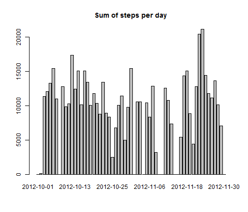
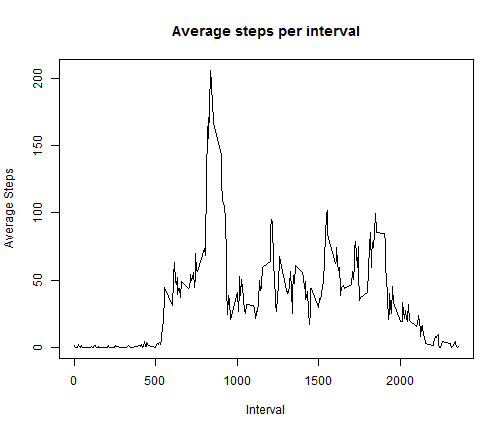
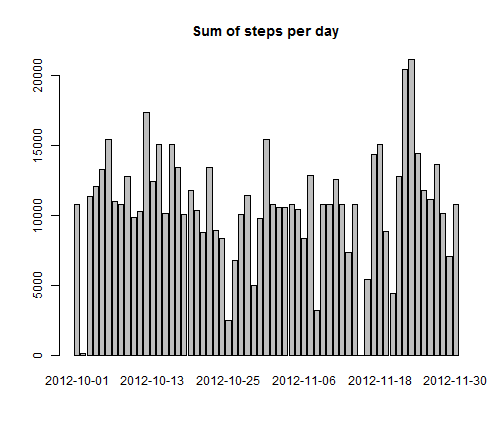

Reproducible Research - Assignment 1
========================================================

Loading and preprocessing the data
-----------------------------------
1. Load the data

```r
data <- read.csv("activity.csv")
```

2. Process/transform the data (if necessary) into a format suitable for your analysis

- Load reshape2 & plyr libraries
- Melt data on date & interval variables


```r
require(reshape2)
```

```
## Loading required package: reshape2
```

```
## Warning: package 'reshape2' was built under R version 3.0.3
```

```r
require(plyr)
```

```
## Loading required package: plyr
```

```
## Warning: package 'plyr' was built under R version 3.0.3
```

```r
molten = melt(data, id = c("date", "interval"))
```


What is mean total number of steps taken per day?
------------------------------------------------

1.Make a histogram of the total number of steps taken each day

```r
new = dcast(molten, date ~ variable, sum, na.rm = TRUE)
barplot(new$steps, names.arg = new$date, main = "Sum of steps per day")
```

 


2.Calculate and report the mean and median total number of steps taken per day

```r
mean(new$steps, na.rm = TRUE)
```

```
## [1] 9354
```

```r
median(new$steps, na.rm = TRUE)
```

```
## [1] 10395
```


What is the average daily activity pattern?
-------------------------------------------
1.Make a time series plot (i.e. type = "l") of the 5-minute interval (x-axis) and the average number of steps taken, averaged across all days (y-axis)

```r
new = dcast(molten, interval ~ variable, mean, na.rm = TRUE)
plot(new$interval, ylab = "Average Steps", xlab = "Interval", new$steps, type = "l", 
    main = "Average steps per interval")
```

 


2.Which 5-minute interval, on average across all the days in the dataset, contains the maximum number of steps?

```r
order = new[with(new, order(-steps)), ]
order[1, ]$interval
```

```
## [1] 835
```


Imputing missing values
-----------------------

1.Calculate and report the total number of missing values in the dataset (i.e. the total number of rows with NAs)

```r
sapply(data, function(x) sum(is.na(x)))
```

```
##    steps     date interval 
##     2304        0        0
```

- Total number of rows missing is 2304 

2.Devise a strategy for filling in all of the missing values in the dataset. The strategy does not need to be sophisticated. For example, you could use the mean/median for that day, or the mean for that 5-minute interval, etc.
- The interval mean is used to fill in missing values. 

3.Create a new dataset that is equal to the original dataset but with the missing data filled in.

```r
impute.mean <- function(x) replace(x, is.na(x), mean(x, na.rm = TRUE))
data2 <- ddply(data, ~interval, transform, steps = impute.mean(steps))
molten = melt(data2, id = c("date", "interval"))
new = dcast(molten, date ~ variable, sum, na.rm = TRUE)
```


4.Make a histogram of the total number of steps taken each day and Calculate and report the mean and median total number of steps taken per day. Do these values differ from the estimates from the first part of the assignment? What is the impact of imputing missing data on the estimates of the total daily number of steps?


```r
barplot(new$steps, names.arg = new$date, main = "Sum of steps per day")
```

 

```r
mean(new$steps, na.rm = TRUE)
```

```
## [1] 10766
```

```r
median(new$steps, na.rm = TRUE)
```

```
## [1] 10766
```

- The average total daily steps is larger when imputing missing values. 
- The median is also slightly higer.

